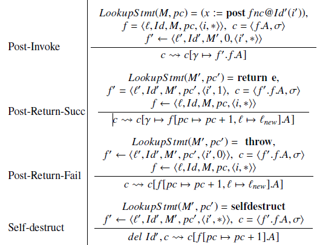

<h1 class="big-title">Zeus: Analyzing Safety of Smart Contracts</h1>

#### Sukrit Kalra, Seep Goel, Mohan Dhawan and Subodh Sharma
:zap: :zap: :zap:

Tommy and Idan

---

# Introduction

- Smart contracts are programs that run on the blockchain
- They are written in high-level languages such as Solidity
- Faithful execution of a smart contract is enforced by the blockchain’s consensus protocol
- Correctness and fairness of the smart contracts is not enforced by the blockchain, and should be verified by the developer

---

# Correctness and Fairness

- Correctness means the code is accurate and complete, producing intended results without errors
- Fairness means the code adheres to the agreed upon higher-level business logic for interaction.
The code shouldn't be biased towards any party, and shouldn't allow any party to cheat

---

# Correctness and Fairness - Example

```c
while (Balance > (depositors[index].Amount * 115/100) && index<Total_Investors) {
    if(depositors[index].Amount!=0)) {
        payment = depositors[index].Amount * 115/100;
        depositors[index].EtherAddress.send(payment);
        Balance -= payment;
        Total_Paid_Out += payment;
        depositors[index].Amount=0; // Remove investor
    } break;
}
```

The contract offers a 15% payout to any investor.
Sadly, the contract has both fairness and correctness issues.

---

# Correctness and Fairness - Example

```c
while (Balance > (depositors[index].Amount * 115/100) && index<Total_Investors) {
    if(depositors[index].Amount!=0)) {
        payment = depositors[index].Amount * 115/100;
        depositors[index].EtherAddress.send(payment);
        Balance -= payment;         // --------------------------
        Total_Paid_Out += payment;  // POTENTIAL OVERFLOW! 😱😱😱
        depositors[index].Amount=0; // --------------------------
    } break;
}
```

Correctness issue: The contract has a potential overflow in the `Total_Paid_Out` variable.

---

# Correctness and Fairness - Example

```c
while (Balance > (depositors[index].Amount * 115/100) && index<Total_Investors) {
    if(depositors[index].Amount!=0)) {
        payment = depositors[index].Amount * 115/100;
        depositors[index].EtherAddress.send(payment);
        Balance -= payment;
        Total_Paid_Out += payment;
        depositors[index].Amount=0;
    } break;
}
```

Fairness issue (1): `index` is never incremented within the loop, and so the payout is made to just one investor.

---

# Correctness and Fairness - Example

```c
while (Balance > (depositors[index].Amount * 115/100) && index<Total_Investors) {
    if(depositors[index].Amount!=0)) {
        payment = depositors[index].Amount * 115/100;
        depositors[index].EtherAddress.send(payment);
        Balance -= payment;
        Total_Paid_Out += payment;
        depositors[index].Amount=0;
    } break; // <------------------------------------
}
```

Fairness issue (2): The `break` statement is inside the `while` statement, and so the loop will always break after the first iteration.
Meaning, only the first investor will get paid. (Prob. the owner)

---

# Incorrect Contracts - Reentrancy

```js
contract Wallet {
    mapping(address => uint) private userBalances;
    function withdrawBalance() {
        uint amountToWithdraw = userBalances[msg.sender];
        if (amountToWithdraw > 0) {
            msg.sender.call(userBalances[msg.sender]);
            userBalances[msg.sender] = 0;                                   
        }
    }
    // ...
}
```

```js
contract AttackerContract {
    function () {
        Wallet wallet;
        wallet.withdrawBalance();
    }
}
```

---

# Incorrect Contracts - Reentrancy

```js
contract Wallet {
    mapping(address => uint) private userBalances;
    function withdrawBalance() {
        uint amountToWithdraw = userBalances[msg.sender];
        if (amountToWithdraw > 0) {
            userBalances[msg.sender] = 0; // Mitigated by swapping the lines
            msg.sender.call(userBalances[msg.sender]);
        }
    }
    // ...
}
```

```js
contract AttackerContract {
    function () {
        Wallet wallet;
        wallet.withdrawBalance();
    }
}
```

---

# Incorrect Contracts - Unchecked Send

- Solidity allows only $2300$ gas upon a send call
- Computation-heavy fallback functiono at the receiving contract will cause the invoking send to fail
- Contracts not handling failed send calls correctly may result in the loss of Ether

---

# Incorrect Contracts - Unchecked Send

```js
if (gameHasEnded && !prizePaidOut) {
    winner.send(1000); // Send a prize to the winner
    prizePaidOut = True;
}
```

The `send` call may fail, but `prizePaidOut` is set to `True` regardless.
Meaning the prize will never be paid out. :cry:

---

# Incorrect Contracts - Failed Send

- Best practices suggest executing a `throw` upon a failed `send`, in order to revert the transaction
- However, this may put contracts in risk

---

# Incorrect Contracts - Failed Send

```js
for (uint i=0; i < investors.length; i++) {
    if (investors[i].invested == min investment) {
        payout = investors[i].payout;
        if (!(investors[i].address.send(payout)))
            throw;
        investors[i] = newInvestor;
    }
}
```

- A DAO that pays dividends to its smallest investor when a new investor offers more money, and the smallest is replaced
- A wallet with a fallback function that takes more than $2300$ gas to run can invest enough to become the smallest investor
- No new investors will be able to join the DAO

---

# Incorrect Contracts - Overflow/underflow

```js
uint payout = balance/participants.length;
for (var i = 0; i < participants.length; i++)
    participants[i].send(payout);
```

- `i` is of type `uint8`, and so it will overflow after $255$ iterations
- Attacker can fill up the first $255$ slots in the array, and gain payouts at the expense of other investors

---

<h1 class="lll-title">Incorrect Contracts - Transaction State Dependence</h1>

- Contract writers can utilize transaction state variables, such as `tx.origin` and `tx.gasprice`, for managing control flow within a smart contract
- `tx.gasprice` is fixed and is published upfront - cannot be exploited :smile:
- `tx.origin` allows a contract to check the address that originally initiated the call chain

---

<h1 class="lll-title">Incorrect Contracts - Transaction State Dependence</h1>

```js
contract UserWallet {
    function transfer(address dest, uint amount) {
        if (tx.origin != owner)
            throw;
        dest.send(amount);
    }
}
```

```js
contract AttackWallet {
    function() {
        UserWallet w = UserWallet(userWalletAddr);
        w.transfer(thiefStorageAddr, msg.sender.balance);
    }
}
```

---

<h1 class="lll-title">Incorrect Contracts - Transaction State Dependence</h1>

```js
contract UserWallet {
    function transfer(address dest, uint amount) {
        if (msg.sender != owner) // FIXED!
            throw;
        dest.send(amount);
    }
}
```

```js
contract AttackWallet {
    function() {
        UserWallet w = UserWallet(userWalletAddr);
        w.transfer(thiefStorageAddr, msg.sender.balance);
    }
}
```

---

# Unfair Contracts - Absence of Logic

- Access to sensitive resources and APIs must be guarded, for instance:

- `selfdestruct`:
    - Kill a contract and send its balance to a given address
    - Should be preceded by a check that only the owner of the contract is allowed to kill it
    - Several contracts did not have this check

---

# Unfair Contracts - Incorrect Logic
```js
 while (balance > persons[payoutCursor_Id_].deposit / 100 * 115) {
    payout = persons[payoutCursor_Id_].deposit / 100 * 115;
    persons[payoutCursor_Id].EtherAddress.send(payout);
    balance -= payout;
    payoutCursor_Id_ ++;
}
```

  - Two similar variables, `payoutCursor_Id` and `payoutCursor_Id_`
  - The deposits of all investors go to the 0th participant, possibly the person who created the contract

---

# Unfair Contracts - Logically Correct but Unfair

##### Auction House Contract

<div class="columns">
<div>

```js
function placeBid(uint auctionId){
    Auction a = auctions[auctionId];
    if (a.currentBid >= msg.value)
        throw;
    uint bidIdx = a.bids.length++;
    Bid b = a.bids[bidIdx];
    b.bidder = msg.sender;
    b.amount = msg.value;
    // ...
    BidPlaced(auctionId, b.bidder, b.amount);
    return true;
}
```
</div>
<div>

- The contract does not disclose whether it is "with reserve" or not
- The seller can participate in the auction and artificially bid up the price
- The seller can withdraw the property from the auction before it is sold
</div>

---

# ZEUS
 - Takes as input a smart contract and a policy against which the smart contract must be verified
 - Performs static analysis atop the smart contract code 
 - Inserts the policy predicates as asserts
 - Converts the smart contract embedded with policy assertions to LLVM bitcode
 - Invokes its verifier to determine assertion violations

---
# Formalizing Solidity Semantics
- Abstract language that captures relevant constructs of Solidity programs
- A program consists of a sequence of contract declarations.
- Each contract is abstractly viewed as a sequence of one or more method
definitions

---

# An Abstract Language modeling Solidity

$$
\begin{array}{l}
P\ ::=\ C^{*}\\
C::=\mathbf{contract} \ @Id\{\ \mathbf{global} \ v\ :\ T;\ \mathbf{function} @Id( l\ :\ T) \ \{S\})^{*}\}\\
S::=( l\ :\ T@Id)^{*} \ \mid l:=e\mid S;S\\
\mid \mathbf{if} \ e\ \mathbf{then} \ S\ else\ S\\
\mid \mathbf{goto} \ l\\
\mid \mathbf{havoc} \ l\ :\ T\mid \mathbf{assert} \ e\mid \mathbf{assume} \ e\\
\mid x:=\mathbf{post} \ \mathbf{function} @\mathbf{Id} \ ( l\ :\ T)\\
\mid \mathbf{return} \ e\mid \mathbf{throw} \mid \mathbf{selfdestruct}
\end{array}
$$

---

# An Abstract Language modeling Solidity

$$
\begin{array}{l}
P\ ::=\ C^{*}\\
\textcolor[rgb]{0.81,0.81,0.81}{C::=\mathbf{contract} \ @Id\{\ \mathbf{global} \ v\ :\ T;\ \mathbf{function} @Id( l\ :\ T) \ \{S\})^{*}\}}\\
\textcolor[rgb]{0.81,0.81,0.81}{S::=( l\ :\ T@Id)^{*} \ \mid l:=e\mid S;S}\\
\textcolor[rgb]{0.81,0.81,0.81}{\mid \mathbf{if} \ e\ \mathbf{then} \ S\ else\ S}\\
\textcolor[rgb]{0.81,0.81,0.81}{\mid \mathbf{goto} \ l}\\
\textcolor[rgb]{0.81,0.81,0.81}{\mid \mathbf{havoc} \ l\ :\ T\mid \mathbf{assert} \ e\mid \mathbf{assume} \ e}\\
\textcolor[rgb]{0.81,0.81,0.81}{\mid x:=\mathbf{post} \ \mathbf{function} @\mathbf{Id} \ ( l\ :\ T)}\\
\textcolor[rgb]{0.81,0.81,0.81}{\mid \mathbf{return} \ e\mid \mathbf{throw} \mid \mathbf{selfdestruct}}
\end{array}
$$

 - A program consists of a sequence of contract declarations


---

# An Abstract Language modeling Solidity

$$
\begin{array}{l}
\textcolor[rgb]{0.81,0.81,0.81}{P\ ::=\ C^{*}}\\
C::=\mathbf{contract} \ @Id\{\ \mathbf{global} \ v\ :\ T;\ \mathbf{function} @Id( l\ :\ T) \ \{S\})^{*}\}\\
\textcolor[rgb]{0.81,0.81,0.81}{S::=( l\ :\ T@Id)^{*} \ \mid l:=e\mid S;S}\\
\textcolor[rgb]{0.81,0.81,0.81}{\mid \mathbf{if} \ e\ \mathbf{then} \ S\ else\ S}\\
\textcolor[rgb]{0.81,0.81,0.81}{\mid \mathbf{goto} \ l}\\
\textcolor[rgb]{0.81,0.81,0.81}{\mid \mathbf{havoc} \ l\ :\ T\mid \mathbf{assert} \ e\mid \mathbf{assume} \ e}\\
\textcolor[rgb]{0.81,0.81,0.81}{\mid x:=\mathbf{post} \ \mathbf{function} @\mathbf{Id} \ ( l\ :\ T)}\\
\textcolor[rgb]{0.81,0.81,0.81}{\mid \mathbf{return} \ e\mid \mathbf{throw} \mid \mathbf{selfdestruct}}
\end{array}
$$

 - Each contract is abstractly viewed as a sequence of one or more method definitions.
 - Persistent storage private to a contract, denoted by the keyword global

---

# An Abstract Language modeling Solidity

$$
\begin{array}{l}
\textcolor[rgb]{0.81,0.81,0.81}{P\ ::=\ C^{*}}\\
\textcolor[rgb]{0.81,0.81,0.81}{C::=\mathbf{contract} \ @Id\{\ \mathbf{global} \ v\ :\ T;\ \mathbf{function} @Id( l\ :\ T) \ \{S\})^{*}\}}\\
S::=( l\ :\ T@Id)^{*} \ \textcolor[rgb]{0.81,0.81,0.81}{\mid l:=e\mid S;S}\\
\textcolor[rgb]{0.81,0.81,0.81}{\mid \mathbf{if} \ e\ \mathbf{then} \ S\ else\ S}\\
\textcolor[rgb]{0.81,0.81,0.81}{\mid \mathbf{goto} \ l}\\
\textcolor[rgb]{0.81,0.81,0.81}{\mid \mathbf{havoc} \ l\ :\ T\mid \mathbf{assert} \ e\mid \mathbf{assume} \ e}\\
\textcolor[rgb]{0.81,0.81,0.81}{\mid x:=\mathbf{post} \ \mathbf{function} @\mathbf{Id} \ ( l\ :\ T)}\\
\textcolor[rgb]{0.81,0.81,0.81}{\mid \mathbf{return} \ e\mid \mathbf{throw} \mid \mathbf{selfdestruct}}
\end{array}
$$

---

# An Abstract Language modeling Solidity

$$
\begin{array}{l}
\textcolor[rgb]{0.81,0.81,0.81}{P\ ::=\ C^{*}}\\
\textcolor[rgb]{0.81,0.81,0.81}{C::=\mathbf{contract} \ @Id\{\ \mathbf{global} \ v\ :\ T;\ \mathbf{function} @Id( l\ :\ T) \ \{S\})^{*}\}}\\
S::=\textcolor[rgb]{0.81,0.81,0.81}{( l\ :\ T@Id)^{*} \ }\mid l:=e\textcolor[rgb]{0.81,0.81,0.81}{\mid S;S}\\
\textcolor[rgb]{0.81,0.81,0.81}{\mid \mathbf{if} \ e\ \mathbf{then} \ S\ else\ S}\\
\textcolor[rgb]{0.81,0.81,0.81}{\mid \mathbf{goto} \ l}\\
\textcolor[rgb]{0.81,0.81,0.81}{\mid \mathbf{havoc} \ l\ :\ T\mid \mathbf{assert} \ e\mid \mathbf{assume} \ e}\\
\textcolor[rgb]{0.81,0.81,0.81}{\mid x:=\mathbf{post} \ \mathbf{function} @\mathbf{Id} \ ( l\ :\ T)}\\
\textcolor[rgb]{0.81,0.81,0.81}{\mid \mathbf{return} \ e\mid \mathbf{throw} \mid \mathbf{selfdestruct}}
\end{array}
$$

---

# An Abstract Language modeling Solidity

$$
\begin{array}{l}
\textcolor[rgb]{0.81,0.81,0.81}{P\ ::=\ C^{*}}\\
\textcolor[rgb]{0.81,0.81,0.81}{C::=\mathbf{contract} \ @Id\{\ \mathbf{global} \ v\ :\ T;\ \mathbf{function} @Id( l\ :\ T) \ \{S\})^{*}\}}\\
S::=\textcolor[rgb]{0.81,0.81,0.81}{( l\ :\ T@Id)^{*} \ \mid l:=e}\mid S;S\\
\textcolor[rgb]{0.81,0.81,0.81}{\mid \mathbf{if} \ e\ \mathbf{then} \ S\ else\ S}\\
\textcolor[rgb]{0.81,0.81,0.81}{\mid \mathbf{goto} \ l}\\
\textcolor[rgb]{0.81,0.81,0.81}{\mid \mathbf{havoc} \ l\ :\ T\mid \mathbf{assert} \ e\mid \mathbf{assume} \ e}\\
\textcolor[rgb]{0.81,0.81,0.81}{\mid x:=\mathbf{post} \ \mathbf{function} @\mathbf{Id} \ ( l\ :\ T)}\\
\textcolor[rgb]{0.81,0.81,0.81}{\mid \mathbf{return} \ e\mid \mathbf{throw} \mid \mathbf{selfdestruct}}
\end{array}
$$

---

# An Abstract Language modeling Solidity

$$
\begin{array}{l}
\textcolor[rgb]{0.81,0.81,0.81}{P\ ::=\ C^{*}}\\
\textcolor[rgb]{0.81,0.81,0.81}{C::=\mathbf{contract} \ @Id\{\ \mathbf{global} \ v\ :\ T;\ \mathbf{function} @Id( l\ :\ T) \ \{S\})^{*}\}}\\
S::=\textcolor[rgb]{0.81,0.81,0.81}{( l\ :\ T@Id)^{*} \ \mid l:=e\mid S;S}\\
\mid \mathbf{if} \ e\ \mathbf{then} \ S\ else\ S\\
\textcolor[rgb]{0.81,0.81,0.81}{\mid \mathbf{goto} \ l}\\
\textcolor[rgb]{0.81,0.81,0.81}{\mid \mathbf{havoc} \ l\ :\ T\mid \mathbf{assert} \ e\mid \mathbf{assume} \ e}\\
\textcolor[rgb]{0.81,0.81,0.81}{\mid x:=\mathbf{post} \ \mathbf{function} @\mathbf{Id} \ ( l\ :\ T)}\\
\textcolor[rgb]{0.81,0.81,0.81}{\mid \mathbf{return} \ e\mid \mathbf{throw} \mid \mathbf{selfdestruct}}
\end{array}
$$

- Regular if-then-else statements

---

# An Abstract Language modeling Solidity

$$
\begin{array}{l}
\textcolor[rgb]{0.81,0.81,0.81}{P\ ::=\ C^{*}}\\
\textcolor[rgb]{0.81,0.81,0.81}{C::=\mathbf{contract} \ @Id\{\ \mathbf{global} \ v\ :\ T;\ \mathbf{function} @Id( l\ :\ T) \ \{S\})^{*}\}}\\
S::=\textcolor[rgb]{0.81,0.81,0.81}{( l\ :\ T@Id)^{*} \ \mid l:=e\mid S;S}\\
\textcolor[rgb]{0.81,0.81,0.81}{\mid \mathbf{if} \ e\ \mathbf{then} \ S\ else\ S}\\
\mid \mathbf{goto} \ l\\
\textcolor[rgb]{0.81,0.81,0.81}{\mid \mathbf{havoc} \ l\ :\ T\mid \mathbf{assert} \ e\mid \mathbf{assume} \ e}\\
\textcolor[rgb]{0.81,0.81,0.81}{\mid x:=\mathbf{post} \ \mathbf{function} @\mathbf{Id} \ ( l\ :\ T)}\\
\textcolor[rgb]{0.81,0.81,0.81}{\mid \mathbf{return} \ e\mid \mathbf{throw} \mid \mathbf{selfdestruct}}
\end{array}
$$
 - goto a given line
---

# An Abstract Language modeling Solidity

$$
\begin{array}{l}
\textcolor[rgb]{0.81,0.81,0.81}{P\ ::=\ C^{*}}\\
\textcolor[rgb]{0.81,0.81,0.81}{C::=\mathbf{contract} \ @Id\{\ \mathbf{global} \ v\ :\ T;\ \mathbf{function} @Id( l\ :\ T) \ \{S\})^{*}\}}\\
S::=\textcolor[rgb]{0.81,0.81,0.81}{( l\ :\ T@Id)^{*} \ \mid l:=e\mid S;S}\\
\textcolor[rgb]{0.81,0.81,0.81}{\mid \mathbf{if} \ e\ \mathbf{then} \ S\ else\ S}\\
\textcolor[rgb]{0.81,0.81,0.81}{\mid \mathbf{goto} \ l}\\
{\mid \mathbf{havoc} \ l\ :\ T\textcolor[rgb]{0.81,0.81,0.81}{\mid \mathbf{assert} \ e\mid \mathbf{assume} \ e}}\\
\textcolor[rgb]{0.81,0.81,0.81}{\mid x:=\mathbf{post} \ \mathbf{function} @\mathbf{Id} \ ( l\ :\ T)}\\
\textcolor[rgb]{0.81,0.81,0.81}{\mid \mathbf{return} \ e\mid \mathbf{throw} \mid \mathbf{selfdestruct}}
\end{array}
$$
  - Asigns a non-deterministic value

---

# An Abstract Language modeling Solidity

$$
\begin{array}{l}
\textcolor[rgb]{0.81,0.81,0.81}{P\ ::=\ C^{*}}\\
\textcolor[rgb]{0.81,0.81,0.81}{C::=\mathbf{contract} \ @Id\{\ \mathbf{global} \ v\ :\ T;\ \mathbf{function} @Id( l\ :\ T) \ \{S\})^{*}\}}\\
S::=\textcolor[rgb]{0.81,0.81,0.81}{( l\ :\ T@Id)^{*} \ \mid l:=e\mid S;S}\\
\textcolor[rgb]{0.81,0.81,0.81}{\mid \mathbf{if} \ e\ \mathbf{then} \ S\ else\ S}\\
\textcolor[rgb]{0.81,0.81,0.81}{\mid \mathbf{goto} \ l}\\
\textcolor[rgb]{0.81,0.81,0.81}{\mid \mathbf{havoc} \ l\ :\ T}\mid \mathbf{assert} \ e\textcolor[rgb]{0.81,0.81,0.81}{\mid \mathbf{assume} \ e}\\
\textcolor[rgb]{0.81,0.81,0.81}{\mid x:=\mathbf{post} \ \mathbf{function} @\mathbf{Id} \ ( l\ :\ T)}\\
\textcolor[rgb]{0.81,0.81,0.81}{\mid \mathbf{return} \ e\mid \mathbf{throw} \mid \mathbf{selfdestruct}}
\end{array}
$$
 - Check of truth value of predicates
 
---

# An Abstract Language modeling Solidity

$$
\begin{array}{l}
\textcolor[rgb]{0.81,0.81,0.81}{P\ ::=\ C^{*}}\\
\textcolor[rgb]{0.81,0.81,0.81}{C::=\mathbf{contract} \ @Id\{\ \mathbf{global} \ v\ :\ T;\ \mathbf{function} @Id( l\ :\ T) \ \{S\})^{*}\}}\\
S::=\textcolor[rgb]{0.81,0.81,0.81}{( l\ :\ T@Id)^{*} \ \mid l:=e\mid S;S}\\
\textcolor[rgb]{0.81,0.81,0.81}{\mid \mathbf{if} \ e\ \mathbf{then} \ S\ else\ S}\\
\textcolor[rgb]{0.81,0.81,0.81}{\mid \mathbf{goto} \ l}\\
\textcolor[rgb]{0.81,0.81,0.81}{\mid \mathbf{havoc} \ l\ :\ T\mid \mathbf{assert} \ e}\mid \mathbf{assume} \ e\\
\textcolor[rgb]{0.81,0.81,0.81}{\mid x:=\mathbf{post} \ \mathbf{function} @\mathbf{Id} \ ( l\ :\ T)}\\
\textcolor[rgb]{0.81,0.81,0.81}{\mid \mathbf{return} \ e\mid \mathbf{throw} \mid \mathbf{selfdestruct}}
\end{array}
$$
 - Blocks until the supplied expression becomes true
---

# An Abstract Language modeling Solidity

$$
\begin{array}{l}
\textcolor[rgb]{0.81,0.81,0.81}{P\ ::=\ C^{*}}\\
\textcolor[rgb]{0.81,0.81,0.81}{C::=\mathbf{contract} \ @Id\{\ \mathbf{global} \ v\ :\ T;\ \mathbf{function} @Id( l\ :\ T) \ \{S\})^{*}\}}\\
S::=\textcolor[rgb]{0.81,0.81,0.81}{( l\ :\ T@Id)^{*} \ \mid l:=e\mid S;S}\\
\textcolor[rgb]{0.81,0.81,0.81}{\mid \mathbf{if} \ e\ \mathbf{then} \ S\ else\ S}\\
\textcolor[rgb]{0.81,0.81,0.81}{\mid \mathbf{goto} \ l}\\
\textcolor[rgb]{0.81,0.81,0.81}{{\mid \mathbf{havoc} \ l\ :\ T\mid \mathbf{assert} \ e\mid \mathbf{assume} \ e}}\\
\mid x:=\mathbf{post} \ \mathbf{function} @\mathbf{Id} \ ( l\ :\ T)\\
\textcolor[rgb]{0.81,0.81,0.81}{\mid \mathbf{return} \ e\mid \mathbf{throw} \mid \mathbf{selfdestruct}}
\end{array}
$$
 - call() invocations (send with argument)
---

# An Abstract Language modeling Solidity

$$
\begin{array}{l}
\textcolor[rgb]{0.81,0.81,0.81}{P\ ::=\ C^{*}}\\
\textcolor[rgb]{0.81,0.81,0.81}{C::=\mathbf{contract} \ @Id\{\ \mathbf{global} \ v\ :\ T;\ \mathbf{function} @Id( l\ :\ T) \ \{S\})^{*}\}}\\
S::=\textcolor[rgb]{0.81,0.81,0.81}{( l\ :\ T@Id)^{*} \ \mid l:=e\mid S;S}\\
\textcolor[rgb]{0.81,0.81,0.81}{\mid \mathbf{if} \ e\ \mathbf{then} \ S\ else\ S}\\
\textcolor[rgb]{0.81,0.81,0.81}{\mid \mathbf{goto} \ l}\\
\textcolor[rgb]{0.81,0.81,0.81}{\mid \mathbf{havoc} \ l\ :\ T\mid \mathbf{assert} \ e\mid \mathbf{assume} \ e}\\
\textcolor[rgb]{0.81,0.81,0.81}{\mid x:=\mathbf{post} \ \mathbf{function} @\mathbf{Id} \ ( l\ :\ T)}\\
\mid \mathbf{return} \ e\textcolor[rgb]{0.81,0.81,0.81}{\mid \mathbf{throw} \mid \mathbf{selfdestruct}}
\end{array}
$$

---

# An Abstract Language modeling Solidity

$$
\begin{array}{l}
\textcolor[rgb]{0.81,0.81,0.81}{P\ ::=\ C^{*}}\\
\textcolor[rgb]{0.81,0.81,0.81}{C::=\mathbf{contract} \ @Id\{\ \mathbf{global} \ v\ :\ T;\ \mathbf{function} @Id( l\ :\ T) \ \{S\})^{*}\}}\\
S::=\textcolor[rgb]{0.81,0.81,0.81}{( l\ :\ T@Id)^{*} \ \mid l:=e\mid S;S}\\
\textcolor[rgb]{0.81,0.81,0.81}{\mid \mathbf{if} \ e\ \mathbf{then} \ S\ else\ S}\\
\textcolor[rgb]{0.81,0.81,0.81}{\mid \mathbf{goto} \ l}\\
\textcolor[rgb]{0.81,0.81,0.81}{\mid \mathbf{havoc} \ l\ :\ T\mid \mathbf{assert} \ e\mid \mathbf{assume} \ e}\\
\textcolor[rgb]{0.81,0.81,0.81}{\mid x:=\mathbf{post} \ \mathbf{function} @\mathbf{Id} \ ( l\ :\ T)}\\
\textcolor[rgb]{0.81,0.81,0.81}{\mid \mathbf{return} \ e}\mid \mathbf{throw} \textcolor[rgb]{0.81,0.81,0.81}{\mid \mathbf{selfdestruct}}
\end{array}
$$

---

# An Abstract Language modeling Solidity

$$
\begin{array}{l}
\textcolor[rgb]{0.81,0.81,0.81}{P\ ::=\ C^{*}}\\
\textcolor[rgb]{0.81,0.81,0.81}{C::=\mathbf{contract} \ @Id\{\ \mathbf{global} \ v\ :\ T;\ \mathbf{function} @Id( l\ :\ T) \ \{S\})^{*}\}}\\
S::=\textcolor[rgb]{0.81,0.81,0.81}{( l\ :\ T@Id)^{*} \ \mid l:=e\mid S;S}\\
\textcolor[rgb]{0.81,0.81,0.81}{\mid \mathbf{if} \ e\ \mathbf{then} \ S\ else\ S}\\
\textcolor[rgb]{0.81,0.81,0.81}{\mid \mathbf{goto} \ l}\\
\textcolor[rgb]{0.81,0.81,0.81}{\mid \mathbf{havoc} \ l\ :\ T\mid \mathbf{assert} \ e\mid \mathbf{assume} \ e}\\
\textcolor[rgb]{0.81,0.81,0.81}{\mid x:=\mathbf{post} \ \mathbf{function} @\mathbf{Id} \ ( l\ :\ T)}\\
\textcolor[rgb]{0.81,0.81,0.81}{\mid \mathbf{return} \ e\mid \mathbf{throw} }\mid \mathbf{selfdestruct}
\end{array}
$$

---

# Language Semantics
$\langle \langle \mathcal{T} ,\sigma \rangle ,\ BC\rangle$ - The blockchain state 
 - $\langle \mathcal{T} ,\sigma \rangle$ - The block $B$ being currently mined
 - $\mathcal{T}$ - The completed transactions that are not committed
 -  $\sigma$ - The global state of the system after executing $\mathcal{T}$
 - $BC$ - The list of commited blocks

<br/>

 $\sigma: id \to g \ , \ g\in Vals$
 - $id$ - Identifier of the contract
 - $g$ - Valuation of global variable

---

# Language Semantics
 $\gamma$ -  A transaction defined as a stack of frames $f$


 $f:=\langle\ell,id,M,pc,v\rangle$ - A frame
- $\ell \in Vals$ - The valuation of the method local variables $l$
- $M$ - The code of the contract with identifier id
- $pc$ - The program counter
- $v:\langle i,o \rangle$ - Auxiliary memory for storing input and output

--- 

# Language Semantics
 - $c:=\langle \gamma, \sigma \rangle$ - The configuration, captures the state of the transaction
  - $\rightsquigarrow$ - Small step operation
  - $\to$ - Transaction relation for globals and blockchain state
  - $\leftarrow$ - Assignment
---
# Language Semantics
<div class='columns'>
<div>

</div>
<div>

</div>
</div>

---
# Formalizing the Policy Language
 - $PVars$ - The set of program variables
 - $Func$ - The set of function names in a contract
 - $Expr$ - The set of conditional expressions
 ---
# Formalizing the Policy Language
  - **Policy specification**: $\langle Sub, Obj, Op, Cond, Res, \rangle$
    - $Sub \in PVar$ - The set of source variables (one or more) that need to be tracked

    - $Obj \in PVar$

    - $Op:=\langle f,trig\rangle, f\in Func, trig\in \{pre, post\}$

    - $Cond \in Expr$

    - $Res \in \{ T, F\}$ 
 ---
 # Formalizing the Policy Language
  - **Policy specification**: $\langle Sub, Obj, Op, Cond, Res, \rangle$
    - $Sub \in PVar$

    - $Obj \in PVar$ - The set of variables representing entities with which the subject interacts

    - $Op:=\langle f,trig\rangle, f\in Func, trig\in \{pre, post\}$ 

    - $Cond \in Expr$ 
    - $Res \in \{ T, F\}$ 
 ---
  # Formalizing the Policy Language
  - **Policy specification**: $\langle Sub, Obj, Op, Cond, Res, \rangle$
    - $Sub \in PVar$
    - $Obj \in PVar$

    - $Op:=\langle f,trig\rangle, f\in Func, trig\in \{pre, post\}$ - The set of side-affecting invocations that capture the effects of interaction between the subject and the object


    - $Cond \in Expr$

    - $Res \in \{ T, F\}$

 ---
  # Formalizing the Policy Language
  - **Policy specification**: $\langle Sub, Obj, Op, Cond, Res, \rangle$
    - $Sub \in PVar$ 

    - $Obj \in PVar$

    - $Op:=\langle f,trig\rangle, f\in Func, trig\in \{pre, post\}$ 


    - $Cond \in Expr$ - The set of predicates that govern this interaction leading to the operation

    - $Res \in \{ T, F\}$

 ---
  # Formalizing the Policy Language
  - **Policy specification**: $\langle Sub, Obj, Op, Cond, Res, \rangle$
    - $Sub \in PVar$ 
    - $Obj \in PVar$ 

    - $Op:=\langle f,trig\rangle, f\in Func, trig\in \{pre, post\}$ 

    - $Cond \in Expr$

    - $Res \in \{ T, F\}$ - Indicates whether the interaction between the subject and operation as governed by the predicates is permitted or constitutes a violation

---

# Zeus Workflow

<!-- $ d2 --theme 3 --sketch --pad=0 workflow.d2 img/workflow.png -->


---

# Implementation
- The Policy builder: $500$ lines of code
- The translator from solidity to LLVM: $3000$ lines of code
- The code was written on C++ using the Abstract Syntax Tree (AST) derived from the Solidity compiler `solc`
- Verifier: Verifiers that are already work with LLVM like `SMACK`, `Seahorn`

---

# End-to-End Example

<div class="columns">
<div>

```js
function transfer() {
    msg.sender.send(msg.value);
    balance = balance - msg.value;
}
```

```xml
<Subject> msg.sender </Subject>
<Object> msg.value </Object>
<Operation trigger="pre"> send </Operation>
<Condition> msg.value <= balance </Condition>
<Result> True </Result>
```

</div>
<div>

```js
havoc balance
B@δ() {
    assert(value <= balance)
    post B'@δ()
    balance = balance - value
}
```
</div>
</div>

---

# End-to-End Example

```js
define void @transfer() {
entry:
    % value = getelementptr %msgRecord* @msg, i32 0, i32 4
    %0 = load i256* % value
    %1 = load i256* @balance
    %2 = icmp ule i256 %0, %1
    br i1 %2, label %"75", label %"74"
"74":
    call void @ VERIFIER error()
    br label %"75"
"75":
    % sender = getelementptr %msgRecord* @msg, i32 0, i32 2
    %3 = load i160* % sender
    %4 = call i1 @send(i160 %3, i256 %0)
    %5 = sub i256 %1, %0
    store i256 %5, i256* @balance
    ret void
}
```

---

# End-to-End Example

```js
define void @transfer() {
entry:
    % value = getelementptr %msgRecord* @msg, i32 0, i32 4
    %0 = load i256* % value     // Load msg.value into %0
    %1 = load i256* @balance    // Load balance into %1
    %2 = icmp ule i256 %0, %1   // Compare %0 and %1 (%2 = 1 if %0 <= %1)
    br i1 %2, label %"75", label %"74"      // Branch based on %2
"74": // If %2 is 0 (i.e., value > balance)
    call void @ VERIFIER error()            // Report error
    br label %"75"
"75": // If %2 is 1 (i.e., value <= balance)
    % sender = getelementptr %msgRecord* @msg, i32 0, i32 2
    %3 = load i160* % sender
    %4 = call i1 @send(i160 %3, i256 %0)    // Call send
    %5 = sub i256 %1, %0                    // balance -= value
    store i256 %5, i256* @balance           // Store updated balance
    ret void
}
```

---

# Handling Correctness Bugs

---

# Handling Correctness Bugs - Reentrancy

```js
contract Wallet {
    mapping(address => uint) private userBalances;
    function withdrawBalance() {
        uint amountToWithdraw = userBalances[msg.sender];
        if (amountToWithdraw > 0) {
            msg.sender.call(userBalances[msg.sender]);
            userBalances[msg.sender] = 0;
        }
    }
    // ...
}
```

```js
contract AttackerContract {
    function () {
        Wallet wallet;
        wallet.withdrawBalance();
    }
}
```

---

# Handling Correctness Bugs - Reentrancy

```js
contract Wallet {
    mapping(address => uint) private userBalances;
    function withdrawBalance() {
        uint amountToWithdraw = userBalances[msg.sender];
        if (amountToWithdraw > 0) {
            msg.sender.call(userBalances[msg.sender]);
            userBalances[msg.sender] = 0;
        }
    }
    // ...
}
```

---

# Handling Correctness Bugs - Reentrancy

```js
contract Wallet {
    mapping(address => uint) private userBalances;
    function withdrawBalance2() {
        uint amountToWithdraw = userBalances[msg.sender];
        if (amountToWithdraw > 0) {
            assert(false);
            msg.sender.call(userBalances[msg.sender]);
            userBalances[msg.sender] = 0;
        }
    }
    function withdrawBalance() {
        uint amountToWithdraw = userBalances[msg.sender];
        if (amountToWithdraw > 0) {
            withdrawBalance2();
            msg.sender.call(userBalances[msg.sender]);
            userBalances[msg.sender] = 0;
        }
    }
}
```

---

# Handling Correctness Bugs - Reentrancy

```js
contract Wallet {
    mapping(address => uint) private userBalances;
    function withdrawBalance2() {
        uint amountToWithdraw = userBalances[msg.sender];
        if (amountToWithdraw > 0) {
            assert(false); // Now it's unreachable
            msg.sender.call(userBalances[msg.sender]);
            userBalances[msg.sender] = 0;
        }
    }
    function withdrawBalance() {
        uint amountToWithdraw = userBalances[msg.sender];
        if (amountToWithdraw > 0) {
            userBalances[msg.sender] = 0; // The safe version :)
            withdrawBalance2();
            msg.sender.call(userBalances[msg.sender]);
        }
    }
}
```

---

# Handling Correctness Bugs - Unchecked Send

```js
// Globals ...
prizePaidOut = False;

if (gameHasEnded && !prizePaidOut) {
    winner.send(1000); // May fail, thus the Ether is lost forever :(
    prizePaidOut = True;
}
```
---

# Handling Correctness Bugs - Unchecked Send

```js
// Globals ...
prizePaidOut = False;
checkSend = True;

if (gameHasEnded && !prizePaidOut) {
    checkSend &= winner.send(1000); // False if send fails
    assert(checkSend);
    prizePaidOut = True;
}
```

- Initialize a global variable `checkSend` to `true`
- Take logical AND of `checkSend` and the result of each `send`
- For every write of a global variable, assert that `checkSend` is `true`

---

# Handling Correctness Bugs - Failed Send

```js
// Globals ...
investors = [ ... ];

for (uint i=0; i < investors.length; i++) {
    if (investors[i].invested == min investment) {
        payout = investors[i].payout;
        if (!(investors[i].address.send(payout)))
            throw;
        investors[i] = newInvestor;
    }
}
```

---

# Handling Correctness Bugs - Failed Send

```js
// Globals ...
investors = [ ... ];
checkSend = True;

for (uint i=0; i < investors.length; i++) {
    if (investors[i].invested == min investment) {
        payout = investors[i].payout;
        if (!(checkSend &= investors[i].address.send(payout)))
            assert(checkSend);
            throw;
        investors[i] = newInvestor;
    }
}
```

- Same as unchecked send, but assert that `checkSend` is `true` before `throw`'s
- Indicates a possibility of reverting the transaction due to control flow reaching a `throw` on a failed `send`

---

# Limitations
* Fairness properties involving mathematical formulae are harder to check
    * ZEUS depends on the user to give appropriate policy
* Zeus is not faithful exactly to Solidity syntax
    * Does not explicitly account for runtime EVM parameters such as gas
    * `throw` and `selfdestruct` are modeled as program exit
* Zeus does not analyze contracts with an assembly block
    * Only $45$ out of $22,493$ contracts in the data set use it
* Zeus does not support virtual functions in contract hierarchy (i.e. `super`)
    * Only $23$ out of $22,493$ contracts in the data set use it

---

# Evaluation
 - $1524$ unique contracts (out of $22,493$ contracts)

<style>
table {
  margin-left: auto;
  margin-right: auto;
}
</style>
| Category | Contracts | Source | LLVM | Send/Call | Ext. Calls |
| :---: | :---: | :---: | :---: | :---: | :---: |
| DAO | 140 | 2.8 | 24.3 | 252 | 350 |
| Game | 244 | 23.3 | 609.2 | 851 | 16 |
| Token | 290 | 25.2 | 385.9 | 311 | 271 |
| Wallet | 72 | 10.8 | 105.9 | 186 | 6 |
| Misc | 778 | 47.6 | 924.3 | 1102 | 498 |
| **Total** | **1524** | **109.7** | **2049.6** | **2702** | **1141** |

---

# Zeus's Performance


---

# Zeus's Performance


---

# Thank you for listening! :zap: :zap:
